# APElevate

A marketplace for AP-exam tutoring. Students buy tokens and spend one to enrol in a live,
small-group class on Zoom. Mentors are students who scored well on an AP exam: they apply with a
score report and a CV, staff review the application, and approved mentors schedule classes
tagged with the College Board units and topics they cover.

I built the first version in high school in Dubai, between July 2022 and February 2023. This
repository is that app recovered in 2026 and rebuilt: same product, current Django, a test suite,
server-verified payments and a new interface. The original code is kept in the history (commit
[`226fd1c`](https://github.com/vramaswamy4/apelevate/commit/226fd1c)) and documented in [`docs/ORIGINAL.md`](docs/ORIGINAL.md).

| 2022 (original code, rendered as-is) | 2026 |
|---|---|
| 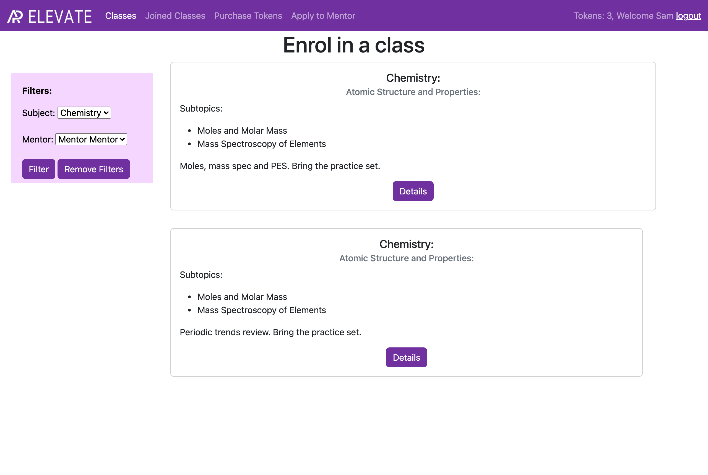 | 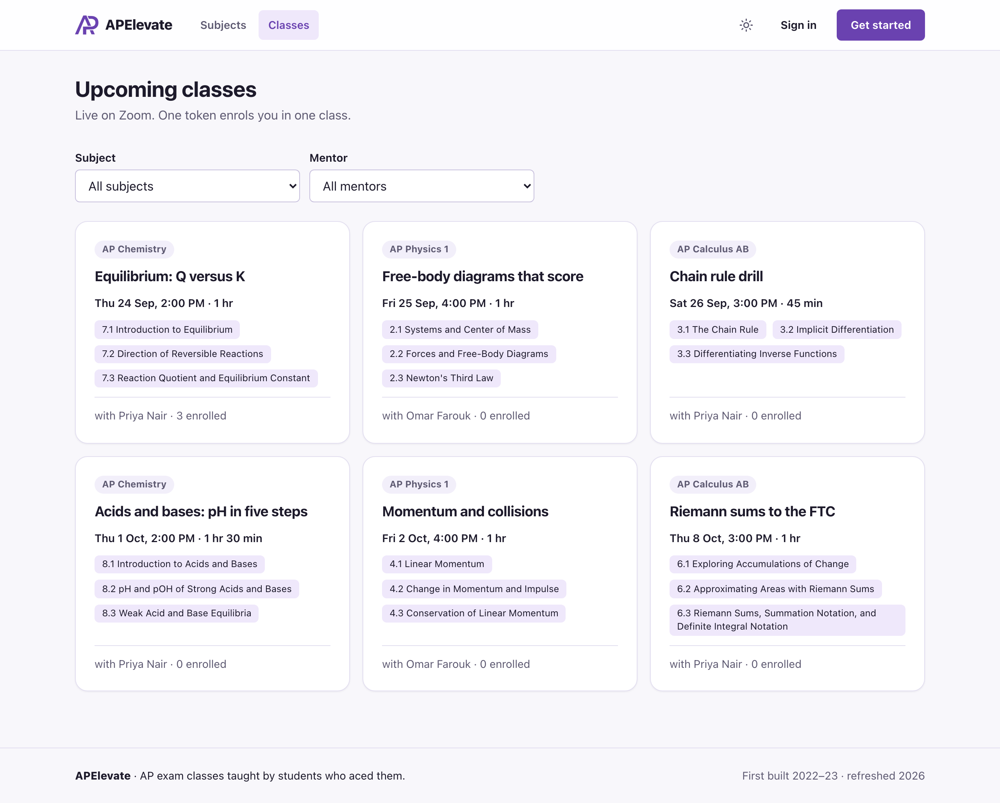 |

- [Live demo](#live-demo)
- [Run it](#run-it)
- [History](#history)
- [What it does](#what-it-does)
- [The study planner (LLM)](#the-study-planner-llm)
- [Data model](#data-model)
- [Stack](#stack)
- [What changed in the refresh](#what-changed-in-the-refresh)
- [Why I changed what I changed](#why-i-changed-what-i-changed)
- [Key decisions](#key-decisions)
- [What I'd still do differently](#what-id-still-do-differently)
- [Layout](#layout)

---

## Live demo

**https://apelevate-1065774348021.us-west1.run.app**

The sign-in page lists the demo accounts; click one to sign in. Payments are simulated, sign-up is
off (so nobody leaves real details where the shared staff account could read them), the demo
accounts can't change their name, email or password, and everything resets every night at 08:00
UTC. The first request after a quiet spell takes a few seconds while an instance starts.

It runs on Google Cloud Run in `us-west1`, with Neon Postgres in AWS `us-west-2` next door.
Everything is Terraform in [`infra/`](infra/): the service, a migrate job and a reset job, a
Cloud Scheduler trigger for the nightly reset, a private Cloud Storage bucket for uploaded
documents, Secret Manager, a budget alert, and Workload Identity Federation so GitHub Actions
deploys without a stored key. After CI passes on `main`,
[`deploy.yml`](.github/workflows/deploy.yml) builds the image, runs migrations as a job, rolls
out the new revision and smoke-tests it. The database URL is the one secret added by hand
([`infra/set-database-url.sh`](infra/set-database-url.sh)), so it never appears in Terraform
state.

---

## Run it

Needs Python 3.12 or newer and `make`. Nothing else: the default database is SQLite and payments
run through a fake provider that makes no network calls.

```bash
make dev
```

That creates `.venv`, installs the pinned dependencies, copies `.env.example` to `.env`,
migrates, loads the curriculum and the demo data, and starts the server on
http://localhost:8000. Sign in with any of these (password `apelevate-demo`):

| Account | Role |
|---|---|
| `student@apelevate.test` | Student with tokens and one upcoming class |
| `mentor@apelevate.test` | Mentor for AP Chemistry and AP Calculus AB, with past classes for analytics |
| `admin@apelevate.test` | Staff: reviews mentor applications, has the Django admin |
| `applicant@apelevate.test` | Student with a mentor application waiting for review |

Other targets:

```bash
make test          # 210 tests, about 2 seconds
make cov           # the same with a coverage report (90% of lines)
make lint          # ruff check + ruff format --check
make eval          # study-planner evals against the models (needs LLM_API_KEY)
make eval-replay   # re-score the recorded eval responses offline
make check         # Django's production checklist (check --deploy) with production settings
make up            # the app on PostgreSQL 17 with docker compose, demo data loaded
make screenshots   # regenerate docs/screenshots with Playwright
```

To take real payments, set `PAYMENTS_BACKEND=paypal` with `PAYPAL_CLIENT_ID` and
`PAYPAL_CLIENT_SECRET` (sandbox credentials work). `.env.example` lists every setting.

---

## History

**2022–23.** I wrote APElevate in Dubai during high school, before university. The migrations
date the work: the data model on 23 July 2022, the mentor-application review in February 2023.
It was a single Django 4.0 app with server-rendered templates, Bootstrap from a CDN and SQLite,
hosted on PythonAnywhere. The repository also has Heroku files (`Procfile`, `runtime.txt`).

**What's unknown.** The PythonAnywhere account no longer exists, so I don't have a record of
when the site went live, what state it was in, or who used it. Several pages in the export are
five-line placeholders (subjects, profile, analytics), and some flows can't have worked as
committed (see below). I've described the code as it is, not as I might remember it.

**Recovery.** In September 2026 I recovered the project from a zip of the old repository. The
Django project sat one folder below the repository root (`APElevate/APElevate/settings.py`); the
requirements file was named `requirements` with no extension and saved as UTF-16 (what
PowerShell's `pip freeze >` writes); the `Procfile` was empty; and the SQLite database, a
`dumpdata` of it, compiled bytecode, collected static files and IDE settings were all committed.
That layout is the most likely reason deployment was painful: Heroku looks for
`requirements.txt` and a `Procfile` at the repository root and found neither. The recovery
commit flattened the tree, fixed the requirements file and removed the secrets and the database.

**Audit.** Before changing anything, I read every file and ran the original code on its original
stack against a fresh database. [`docs/ORIGINAL.md`](docs/ORIGINAL.md) has the full list; the
short version:

- `migrate` crashed on an empty database, because a form queried the database at import time.
- Visiting `/payment-complete/180` added 20 tokens. The server never checked with PayPal.
- Enrolling was free and showed the Zoom password, whatever your balance.
- Mentor applications were saved without the applicant, so accepting one always crashed.
- Classes were saved without their mentor, so no mentor ever saw their own classes.
- A new class didn't appear in the class list until another student had joined it.
- A student promoted to mentor still couldn't open the mentor portal: the role check only read
  a user's first group.
- There were no tests.

**Refresh (2026).** The rebuild keeps the product and its prices, finishes the pages that were
placeholders, and replaces the rest. [`docs/CHANGELOG.md`](docs/CHANGELOG.md) has it phase by
phase.

---

## What it does

**Students** sign up with an email address, buy tokens in bundles (1 for $20, 5 for $80, 10 for
$120, 20 for $180, the 2022 prices), browse classes by subject or mentor, and enrol for one token.
The Zoom link, meeting ID and passcode appear once they're enrolled. If nobody is teaching a unit
they need, they can request a class on it.

**Mentors** start as students. They apply for a subject with a short bio, three written answers,
an AP score report and a CV. Once accepted, they schedule classes: pick a subject they're
approved for, tick the topics it covers, set a time in their own time zone and paste the Zoom
link. The mentor portal shows upcoming classes, open class requests for their subjects, and
analytics (hours taught, distinct students, enrolments and tokens earned, by month and by
subject), all computed from the classes and enrolments themselves.

**Staff** review applications in a queue, download the documents through a permission-checked
view, and accept or reject with an optional note; the applicant gets an email either way.
Accepting creates the mentor profile. The Django admin covers the rest, with money records
read-only.

| | |
|---|---|
| 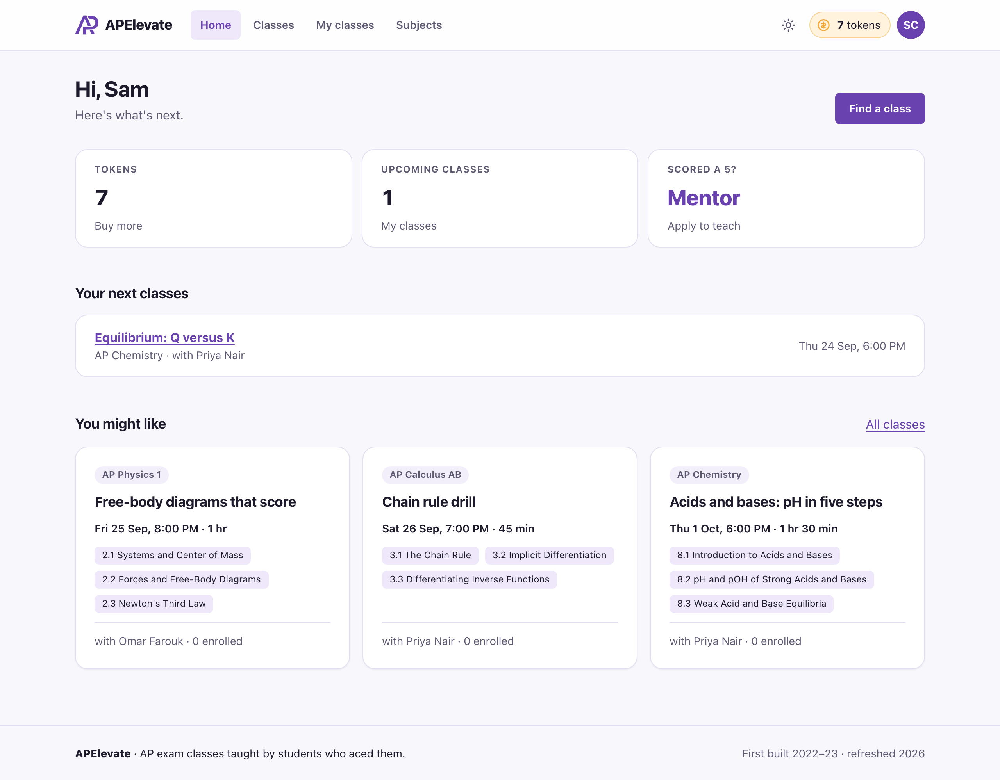 | 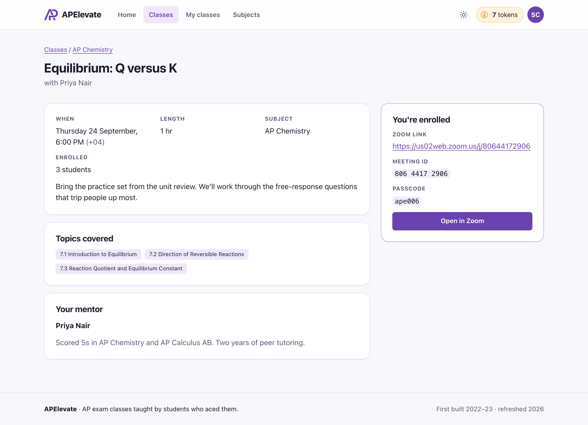 |
| 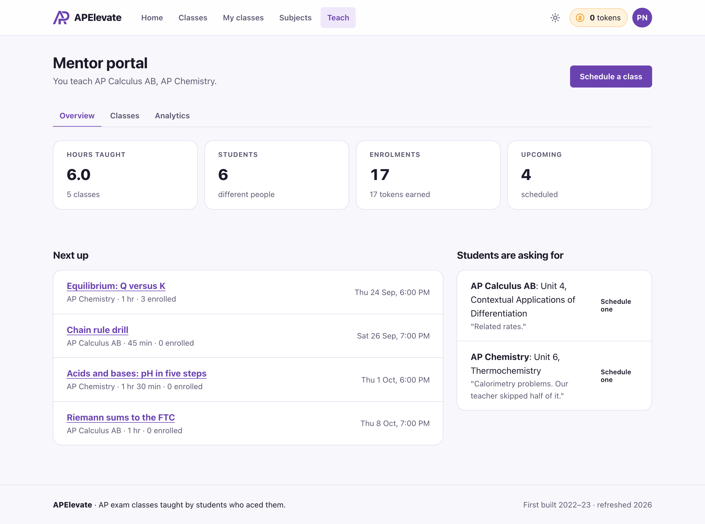 | 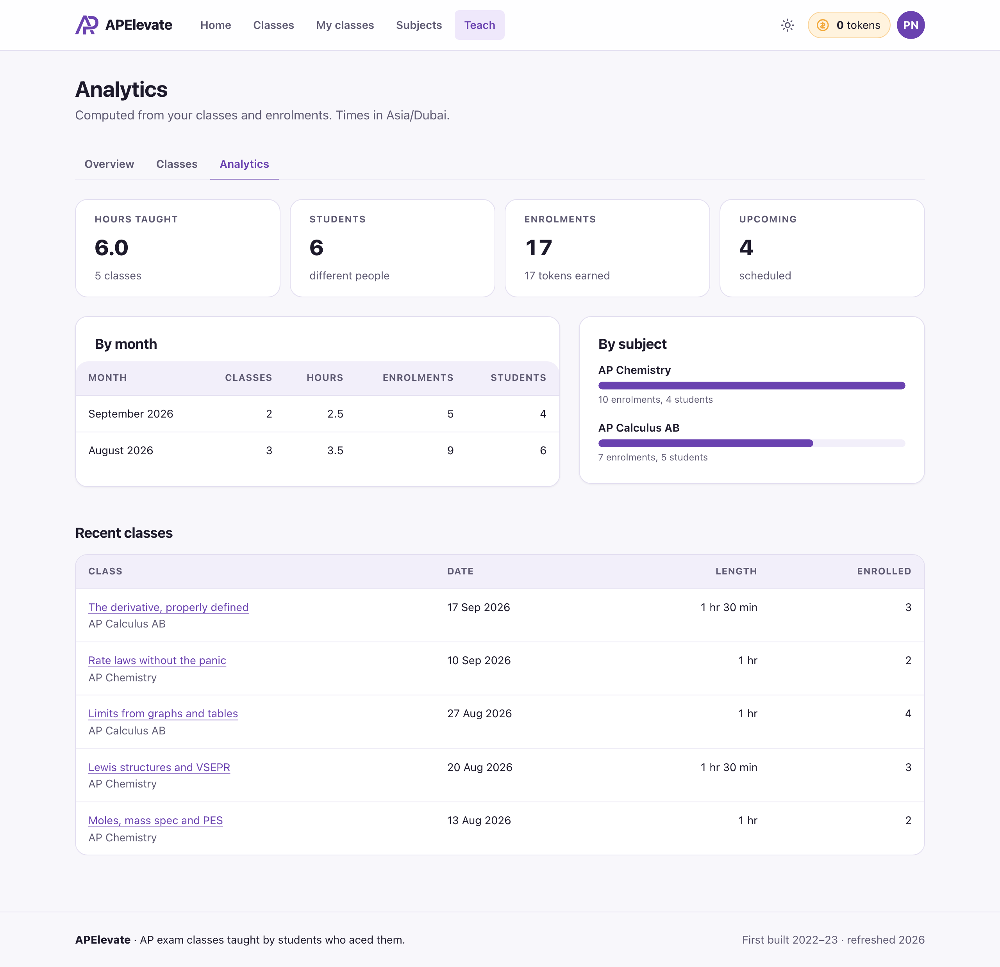 |
| 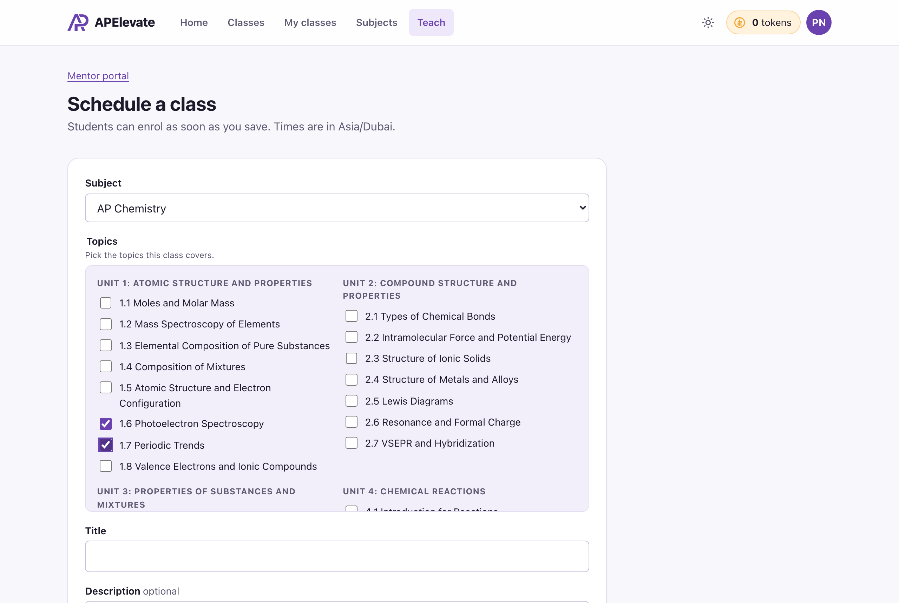 | 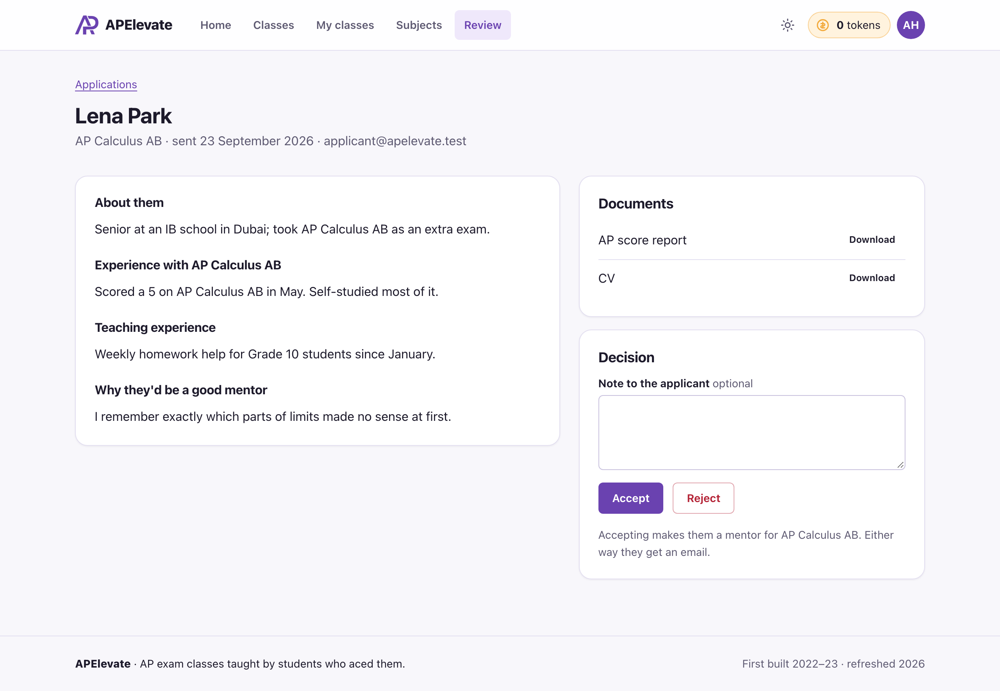 |
| 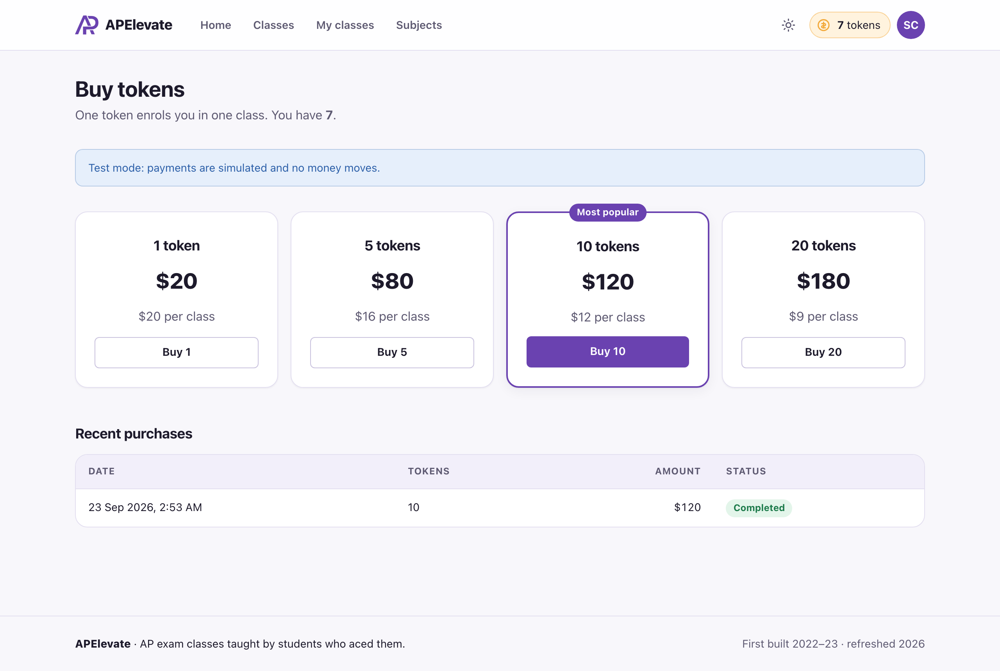 | 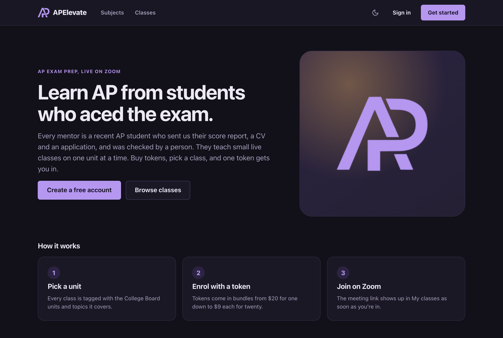 |

Phone: [home](docs/screenshots/phone-home.png) · [class](docs/screenshots/phone-class.png) ·
[my classes](docs/screenshots/phone-my-classes.png) ·
[mentor portal](docs/screenshots/phone-mentor-portal.png). The 2022 pages are in
[`docs/screenshots/2022/`](docs/screenshots/2022/), rendered from the original code on Django
4.0.6 because no screenshots from the time survive.

## The study planner (LLM)

Added in 2026, not part of the original. A student picks a subject, an exam date, the hours
they can study each week and the units they find hardest, and gets a week-by-week plan up to
the exam: which topics each week, concrete tasks, and the live classes on APElevate that fit.
It's written by an open-weights model (`openai/gpt-oss-120b` on Groq's free tier) and checked
by code before anyone sees it.

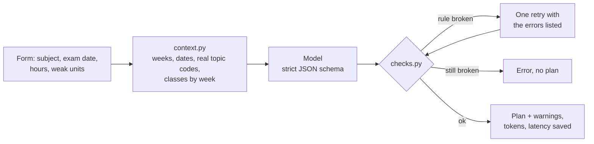

- **Code computes, the model judges.** The number of weeks, each week's start date, which
  week each class falls in, and the only topic codes and class ids that exist are worked out
  by code and handed to the model as data. The model decides what to study when.
- **Nothing invented reaches a student.** Every plan is checked: an unknown topic or class, a
  class in the wrong week, more hours than the student has, or wrong week numbering is a rule
  break. The model gets one corrective retry with the errors listed; if the plan is still
  wrong, the student gets an error. Softer problems (a unit never covered, a weak unit left
  late) are shown with the plan.
- **No free text goes to the model**, only form choices, so there's nothing to inject a prompt
  through.
- **Provider-agnostic.** Plain HTTP to any OpenAI-compatible API (`planner/llm.py`), so
  switching models or hosts is configuration. A fake model with the same interface runs the
  whole feature offline in development and tests.
- **Cost controls.** A daily limit per user, a global daily token budget kept under the
  provider's free quota, identical requests served from a cache, and tokens, latency, model
  and attempts recorded on every plan.

**Evals.** `make eval` runs 24 fixed cases (every subject; one-week sprints and 16-week caps;
one hour a week and twenty; no weak units and all of them; no classes and one almost every
week) through the same code path the page uses, and scores valid plans, first-attempt
success, clean plans, quality warnings, class use, latency and tokens. Responses are recorded,
so `make eval-replay` re-scores everything offline without a key. The results and the model
decision are in [`docs/EVALS.md`](docs/EVALS.md). Two things they changed: prompt v2 fixed a
contradiction between two rules that v1's results exposed (clean plans 62% → 88%), and
`gpt-oss-120b` was chosen over the faster `gpt-oss-20b` because it returned a valid plan in
24 of 24 cases against 17.

---

## Data model

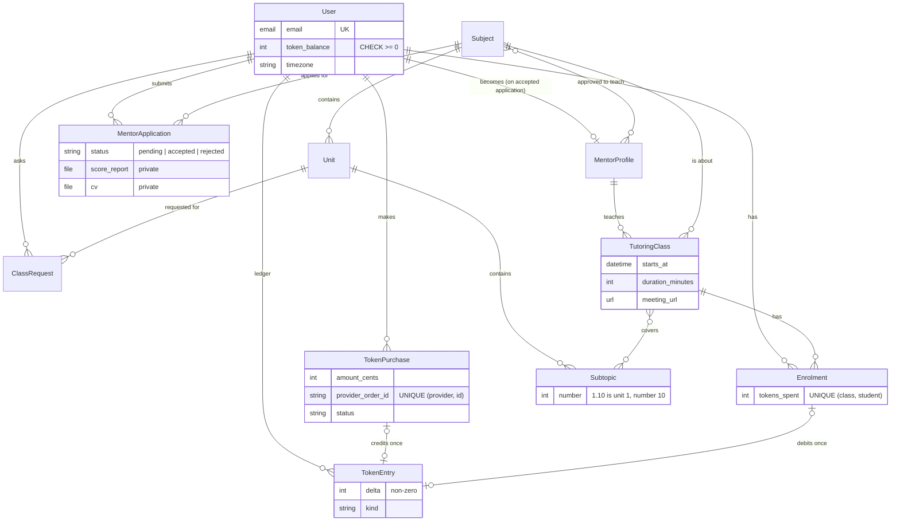

Rules the database enforces, so application code can't get them wrong:

| Rule | Mechanism |
|---|---|
| A balance never goes below zero | `CHECK (token_balance >= 0)`; debits are one `UPDATE … SET token_balance = token_balance - 1` |
| A student enrols in a class once | `UNIQUE (tutoring_class, student)` |
| A purchase credits tokens once; an enrolment debits once | One-to-one keys from the ledger to `TokenPurchase` and `Enrolment` |
| A provider order maps to one purchase | `UNIQUE (provider, provider_order_id)` |
| One pending mentor application per user | Partial unique index: `UNIQUE (user) WHERE status = 'pending'` |
| Unit and topic numbers are unique within their parent | `UNIQUE (subject, number)`, `UNIQUE (unit, number)` |
| A subject with classes, or a class with enrolments, can't be deleted | `on_delete=PROTECT` |

`User.token_balance` is a cached total of the ledger, written only by `payments/wallet.py` in
the same transaction as the ledger row. `manage.py audit_wallets` checks the two agree.

---

## Stack

| | 2022 | 2026 |
|---|---|---|
| Language | Python 3.10 | Python 3.12+ (3.13 in Docker and CI) |
| Framework | Django 4.0.6 (out of support since April 2023) | Django 5.2 LTS |
| Database | SQLite | SQLite by default; PostgreSQL 17 in Docker, CI and production (psycopg 3) |
| Frontend | Bootstrap 5 and 4, jQuery, Font Awesome from CDNs | Server-rendered templates, one owned stylesheet, htmx 2 (vendored) |
| Payments | PayPal buttons with `client-id=test`, trusted by the browser | PayPal Orders v2 over REST, created and captured by the server (httpx) |
| Static files | None in production | whitenoise with hashed, compressed files |
| Config | Secrets in `settings.py` | Environment variables (django-environ), `.env.example` |
| Tests | None | pytest-django: 210 tests, 90% line coverage |
| Tooling | None | ruff, pre-commit, Makefile, Dockerfile, docker compose, GitHub Actions |
| LLM | None | `gpt-oss-120b` on Groq via an OpenAI-compatible client, schema-checked, evaluated |
| Hosting | PythonAnywhere | Google Cloud Run + Neon Postgres, Terraform, keyless CD from GitHub Actions |

---

## What changed in the refresh

| Problem in 2022 | Fix in 2026 |
|---|---|
| `migrate` crashed on a fresh database (queries at import time) | Form choices are callables; `make dev` goes from clone to running app in one command |
| Tokens credited by visiting a URL; the price came from the URL | Server creates the PayPal order from its own price table, captures it, and verifies order id, status, amount, currency and reference before crediting |
| No record of purchases or spending | `TokenPurchase` and a `TokenEntry` ledger; balance = sum of entries, checked by `audit_wallets` |
| Enrolling was free | One token, taken atomically with the enrolment; database constraints stop double enrolment and overdraft |
| Zoom credentials visible to anyone who enrolled (and enrolling was free) | Visible only to enrolled students, the class's mentor and staff |
| Accept/reject and payment completion were `GET` links | State changes are `POST` with CSRF; `GET` returns 405 |
| Role check read the first auth group only; "not authorized" came back as HTTP 200 | Roles come from data (`MentorProfile`, `is_staff`); every view requires login unless marked public (`LoginRequiredMiddleware`); wrong role is a 403 |
| Any file type or size accepted for CVs and score reports | PDF/PNG/JPEG, 5 MB, contents checked against the extension, random names, private storage with no URL, staff-only download view |
| `DEBUG` on by default, `ALLOWED_HOSTS = ['*']`, secrets in code | Environment config; production refuses to start without a secret key; HTTPS, HSTS and secure cookies behind one flag; `check --deploy` clean in CI |
| Applications saved without their user; accepting crashed | Services own the rules; accepting creates a `MentorProfile` for the subject, exactly once, under a row lock |
| Classes saved without their mentor; subject and topics discarded | One class form: subject limited to the mentor's approved subjects, topics loaded for that subject (htmx), time in the mentor's time zone |
| New classes hidden until someone else enrolled | Class list shows every upcoming class, with working subject and mentor filters |
| Topic "1.10" stored as the float 1.1 | Integer topic numbers; `1.10` sorts after `1.9` |
| 72 queries to render 12 classes | `select_related` / `prefetch_related` in queryset methods; tests assert page cost doesn't grow with rows |
| Hours, students and revenue stored as counters that nothing updated | Computed from classes and enrolments (grouped SQL, by month and subject) |
| Placeholder pages: subjects, profile, analytics, class requests | Built |
| Zoom link limited to 30 characters | `URLField(max_length=500)`, https only |
| No tests, CI, lint or formatting | 210 tests on SQLite and PostgreSQL in GitHub Actions, ruff, pre-commit |
| Seven copies of a 70-line `<style>` block, two base layouts, three CSS frameworks | One design system with light and dark themes, accessible forms, responsive tables |
| Nested project folder, misnamed UTF-16 requirements, empty Procfile | Flat layout (`config/` + one package per domain), pinned requirements, working Procfile with a release-phase migration, Dockerfile |

---

## Why I changed what I changed

The 2022 code is what I could write at the time, and reading it now was useful: most of its
problems are things I've since learned to prevent, mostly by building
[JustBook](https://github.com/vramaswamy4/justbook-availability-engine), a booking and payments
platform I run in production, and [Flagdown](https://github.com/vramaswamy4/flagdown), a set of
Go microservices. The refresh applies those habits to a small codebase, where each one is easy
to see. These are the changes I'd defend in a review, and why.

**A test suite, written before trusting any of it.** The 2022 app had no tests, and it shows:
the two main flows (a student enrolling, a student becoming a mentor) both broke in ways a
single end-to-end test would have caught on the first run. The new suite starts from those
flows and from the audit, so most tests are named after a 2022 failure and fail if it comes
back. It covers more than happy paths. There's a permission matrix of every page against every
role, plus a test that fails when a new URL isn't in the matrix. There are payment tests against
a fake PayPal API that underpay, report pending captures and time out. And there are query-budget
tests that render each list page with 2 rows and with 10 and require the same number of queries.
JustBook taught me that a rule nothing checks drifts: the N+1s and the missing access checks I
found there came from code that looked right and had nothing guarding it. So the suite runs
against PostgreSQL as well as SQLite in CI, because the constraints that protect money behave
differently across databases and I want to know they hold where production would run.

**Rules in the database, not only in the code.** In 2022, "a student can't enrol twice" and "a
balance can't go negative" were never written down anywhere. The fix isn't more `if` statements
in the view. It's a unique index and a check constraint, so two requests racing each other
can't both win, and a future code path that forgets the rule still can't break it. That comes
straight from JustBook, where the idempotency guard for loyalty points had to move *inside* the
money helper and onto keys the database enforces, after "every caller checks first" let a double
redemption through. Here, each purchase can credit tokens once and each enrolment can debit once
because the ledger's foreign keys to them are unique, not because the code remembers to check.

**Never trust the browser with money.** The 2022 payment flow let the browser announce that a
payment had succeeded. Now the server creates the order with its own price, captures it, and
reads the amount, currency and reference back from PayPal before crediting anything. Both calls
carry an idempotency key, so a retry after a timeout returns the original result instead of
charging twice. There's also a `reconcile_purchases` command for the case where a buyer approves
and closes the tab. Handlers that stay correct when a message is redelivered were the core of
Flagdown's reliability work; payments are the same problem with money attached.

**A Makefile, a Dockerfile and one command to run.** The 2022 project probably didn't deploy
easily, and I can say exactly why now: the files a host looks for were in the wrong folder, in
the wrong encoding, or empty. A new reader, or me in three years, should get from `git clone` to
a running app with demo data without reading anything. `make dev` does that with SQLite. `make
up` does it on PostgreSQL in Docker, which is also what CI boots and hits over HTTP. Flagdown
runs its whole stack locally with one Tilt command, and I've stopped accepting less than that.
The Makefile is also documentation: `make help` lists every workflow in the project.

**Config from the environment, and production that refuses to start wrong.** The original
settings had the Django secret key and a Gmail password in them, and `DEBUG` on. Now nothing
environment-specific is in code. With `DEBUG` off the app won't boot without a real secret key,
and `check --deploy` runs in CI with production settings, including a custom check that warns
if production is configured with the fake payment provider. It's cheaper to make a bad
configuration impossible to ship than to remember not to ship it.

**Secure by default.** The 2022 app protected views one decorator at a time and got several
wrong. Django 5.1's `LoginRequiredMiddleware` flips that: every view requires sign-in unless it's
explicitly marked public, so a forgotten decorator fails closed. JustBook enforces the same idea
with an audit that fails the build on any unguarded route. Roles now come from data (a mentor is
someone with a mentor profile, staff is `is_staff`) instead of auth groups created by hand and
read in whatever order the database returns them.

**Thin views, rules in one place.** Every rule that matters (enrolling, crediting a purchase,
deciding an application) is a function in a `services.py` or `wallet.py` module. Views parse the
request and render the result. That's why the rules are testable without HTTP, and why the htmx
endpoint and the plain-form endpoint for enrolment can't disagree: they call the same function.

**The UI: an owned design system instead of three frameworks.** The 2022 templates loaded
Bootstrap 5, Bootstrap 4, jQuery and Font Awesome, sometimes all on one page, and pasted the same
70-line style block into seven templates. JustBook went through the same thing: it started on
Bootstrap and later removed it completely for a design system it owns, because theming and
consistency need one source of truth. Here that's one stylesheet built on tokens (colour,
spacing, type), with a dark theme that's just a second set of token values. The components are
used the same way on every page, and forms render through one shared field template, so labels,
help text and errors are accessible everywhere at once rather than page by page. I used htmx only
where a page reload was the wrong experience (enrolling, reviewing, filtering, picking topics),
and each of those forms still submits as a plain form without JavaScript. I kept the 2022 brand: the
"AP" monogram and the purple come from the original logo.

**Documentation that says what's true.** The first thing I wrote in 2026 wasn't code. It was
`docs/ORIGINAL.md`, an audit of the original with each problem numbered and reproduced, and
commits that reference those numbers. I've learned to write down what the system actually does
before changing it: in JustBook that's a dated decision log and a claims file tying every number
in the README to the code that proves it. This README follows the same rule. Where I don't know
something about 2022, it says so.

---

## Key decisions

| Decision | Why | Instead of |
|---|---|---|
| Keep Django and server-rendered templates | The product is forms, lists and a few interactive panels; htmx covers the interactive parts with no build step | A React front end and a JSON API |
| Fresh migrations instead of migrating the 2022 schema | No 2022 database survives; renaming and splitting the models through six old migrations would carry the old design forward for no user | Squashing and altering the originals |
| Token balance as a cached column plus a ledger | The ledger is the audit trail; the column makes the balance cheap to read and lets a check constraint stop overdraft | Summing the ledger on every page; a balance column with no history |
| Enrolment costs one token, enforced | The 2022 purchase page said "each class costs 1 token"; nothing enforced it | Leaving enrolment free |
| Accepting an application creates a `MentorProfile` | A mentor is then a fact in the data, not an auth group; stats and permissions hang off it | Auth groups created by hand |
| Mentor stats computed, not stored | The 2022 counters were never updated; derived numbers can't drift | Counter columns updated on each enrolment |
| PayPal kept, verified on the server | Same provider as 2022, so the product stays the same; the fix was server-side capture and verification | Switching to Stripe |
| A fake payment provider behind the same interface | The whole flow runs locally and in tests with no network and no credentials, through the same verification code | Mocking at the view level |
| Uploads in private storage with no URL | CVs and score reports are personal data, often about high-school students | Serving them from `MEDIA_URL` |
| Timezone per user, UTC in the database | An online class is attended from wherever the students are; each person sees class times in their own zone | One site-wide time zone |
| Email login, custom user model | Nobody remembers a username; a custom user model is the Django-recommended start and costs nothing with fresh migrations | Username login on `auth.User` |

---

## What I'd still do differently

**Known limitations**

- The PayPal client is tested against a fake Orders v2 API (`httpx.MockTransport`) modelled on
  PayPal's documented responses. It hasn't been run against the PayPal sandbox with real
  credentials in this refresh.
- There are no PayPal webhooks. A purchase approved in a browser that then closes is completed
  by `reconcile_purchases`, which has to be scheduled; a webhook would do it immediately.
- No cancellations or refunds. A mentor can't cancel a class, and a student can't unenrol. The
  schema protects paid enrolments from deletion but there's no refund path yet.
- Classes have no capacity limit, and mentors can't edit a class after scheduling it (staff can,
  in the admin).
- Zoom passcodes are stored in plain text, because they have to be shown to enrolled students.
  Generating meetings through the Zoom API would remove them from the database entirely.
- Emails are sent in the request process, after the transaction commits. At any real volume they
  belong in a background worker.
- Login has no rate limiting.
- The seeded curriculum lists the opening topics of each unit, not the full course outline.

**If I were starting it today**

I'd write the ledger and the enrolment service first, with their tests, and build the pages on
top. The 2022 version started from templates and never got to the rules, which is why every rule
that mattered was missing.

---

## Layout

```
config/        settings (env-driven), test settings, URLs, WSGI
core/          dashboard, role decorators, timezone middleware, template filters, seed_demo
accounts/      email-login User, MentorProfile, MentorApplication, review, private uploads
catalog/       Subject → Unit → Subtopic, subject pages, seed_curriculum
classes/       TutoringClass, Enrolment, ClassRequest, enrolment service, mentor portal, stats
payments/      bundles, TokenPurchase, TokenEntry ledger, wallet, PayPal and fake providers
planner/       study planner: context, prompt, checks, LLM client, service, eval harness
evals/         eval cases, recorded model responses, results per model and prompt
templates/     one base layout, partials, per-app pages
static/        css/app.css (design system), js/app.js (theme toggle), vendor/htmx.min.js
tests/         pytest-django suite
scripts/       screenshots.py
docs/          ORIGINAL.md (the 2022 audit), CHANGELOG.md, screenshots/
```
