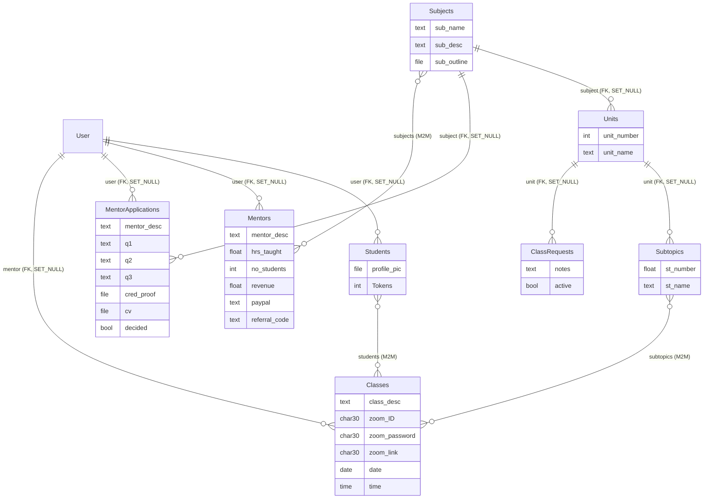

# APElevate as recovered: the original app

This document describes the code in commit `226fd1c`, the original APElevate app as recovered from
a 2023 export. The only changes in that commit were removing the hardcoded secrets and the
development database. Nothing here has been fixed yet. Every statement comes from the code, the
migrations, or a scripted run of the app (Python 3.12, the pinned Django 4.0.6, a fresh SQLite
database, driven by Django's test client). File references point at that commit.

## Provenance

| What | Evidence |
|---|---|
| Framework | Django 4.0.6 (`requirements.txt`; every migration header says "Generated by Django 4.0.6") |
| First migration | 23 July 2022 (`0001_initial.py`) |
| Last migration | 13 February 2023 (`0006_alter_mentorapplications_decided.py`) |
| Static files | Modified 15 February 2023 on disk (the export date, probably) |
| Hosting | `Procfile` runs `gunicorn APElevate.wsgi`; `runtime.txt` pins `python-3.10.1` (Heroku style). No PythonAnywhere config is in the repo. |
| Git history | None before the recovery commit. The original repository's history is not part of the export. |

The app was built between July 2022 and February 2023: the data model in summer 2022, and the
mentor-application review (`accepted`, then renamed to `decided`) in February 2023. It was hosted on
PythonAnywhere, and that account no longer exists, so there's no record of what was live or who
used it. This export is the only surviving copy.

### How the export was laid out

The original repository (preserved as `APElevate-master.zip`) held the Django project one folder
below the repository root, with the default `startproject` name repeated:

```
APElevate-master/            <- git root
  .idea/                     <- PyCharm settings, committed
  APElevate/                 <- Django project root (manage.py lives here)
    APElevate/               <- settings package
    APE/                     <- the app (with __pycache__/*.pyc committed)
    templates/  static/
    staticfiles/             <- collectstatic output, committed (Django admin's CSS and JS)
    db.sqlite3               <- development database, committed
    whole.json               <- a `dumpdata` of that database, committed
    Procfile                 <- empty
    requirements             <- no .txt extension, UTF-16 encoded
    runtime.txt
```

That layout breaks deployment in three ways. Heroku looks for `requirements.txt` and `Procfile` at
the repository root: here one was a folder down, misnamed and in UTF-16 (what PowerShell's
`pip freeze > requirements` writes), and the other was empty. On PythonAnywhere, the WSGI file and
the virtualenv have to point at the inner `APElevate/` folder, and `APElevate/APElevate/` makes it
easy to point one level off. The recovery commit already flattened the tree by one level, re-encoded
the requirements as `requirements.txt`, and dropped the database, dump, bytecode and IDE files. The
refresh goes further: the settings package is renamed to `config/`, so no folder shares a name
with its parent.

Size: about 770 lines of Python outside migrations (about 520 of them in the `APE` app), 30
templates (six are five-line stubs), and a 15-line stylesheet. Most styling is Bootstrap from a CDN
plus `<style>` blocks copied into each template.

## What the app does

### Roles

Roles are Django auth **groups** with fixed names: `students`, `mentors`, `admin`. No migration or
fixture creates them, so someone had to add them by hand in the Django admin. Every signed-in user
is also expected to have a `Students` row, and nearly every view fetches it to show the token
balance in the nav bar.

### Pages, and how complete each one is

| URL | View | Who | State |
|---|---|---|---|
| `/` | `home_page` | anonymous | Works: a login button, a sign-up button and the logo |
| `/signup/` | `sign_up` | anonymous | Works if the `students` group exists. Creates a `User`, adds them to `students` and creates a `Students` row. |
| `/login/`, `/logout/` | `log_in`, `logout_page` | all | Works. Login always sends you to the student dashboard. |
| `/reset_password/` and the rest of the flow | Django's `PasswordReset*View` | all | Works if Gmail SMTP credentials are set |
| `/forgot/` | `forgot_password` | all | Broken: renders `forgot_password.html`, which doesn't exist |
| `/student-dashboard/` | `std_dashboard` | signed in | Works: two buttons (Enrol, Joined Classes) |
| `/classes/` | `enrol_page` | signed in | Partly broken: see "Correctness" below. The subject and mentor filter dropdowns are hardcoded (`<option value="volvo">Chemistry</option>`). |
| `/classes-filtered/` | `enrol_page_filtered` | signed in | Placeholder: shows the first three classes and ignores the filter |
| `/classes/class-info/<id>` | `class_info` | signed in | Shows class details. POSTing enrols you. |
| `/joined-classes/` | `joined_classes` | signed in | Lists classes you're enrolled in, with the Zoom ID, password and link |
| `/purchase-tokens/` | `purchase_tokens` | signed in | Four fixed bundles: 1 token for $20, 5 for $80, 10 for $120, 20 for $180 |
| `/purchase-tokens/payment_portal/<cost>` | `payment_portal` | signed in | PayPal Smart Buttons with `client-id=test` (the PayPal sandbox) |
| `/payment-complete/<cost>` | `payment_complete` | signed in | Credits tokens based on `<cost>` in the URL |
| `/mentor-applications/` | `mentor_application` | `students` | Form: bio, three questions, a score-report upload and a CV upload |
| `/applications/` | `applications` | `admin` | Lists undecided applications with Accept and Reject links |
| `/applications/accept/<id>`, `/reject/<id>` | `accept`, `reject` | `admin` | Accept adds the applicant to `mentors`. Both mark the application `decided`. |
| `/mentor-dashboard/` | `men_dashboard` | `mentors`, `admin` | Two buttons (Create a Class, My Classes) |
| `/create-a-class/`, `/create-a-class2/`, `/create-a-class3/` | `create_a_class*` | `mentors`, `admin` | A three-step wizard: subject, then unit, then details. Steps 1 and 2 discard their input. |
| `/my-classes/` | `my_classes` | `mentors`, `admin` | Lists the mentor's classes with enrolled students |
| `/admin/` | Django admin | staff | All eight models registered with default options |

Not built, though a model field or a stub template exists: the subjects and units browser
(`subjects.html` is a stub), profile and edit profile (stubs), mentor analytics (`analytics.html`
is a stub linking to a URL name that doesn't exist, and no view or URL fills in `Mentors.hrs_taught`,
`no_students` or `revenue`), adding subjects (stub), application details (stub), and class requests
(`ClassRequests` has a model and an admin registration but no view). Whether a deployed version
went further is unknown (see "Decisions for the refresh").

## Data model



The curriculum tree is `Subjects → Units → Subtopics`, and a class covers a set of subtopics.
Students connect to classes directly through the M2M, with no enrolment row, so nothing records
when someone enrolled or what they paid. `Classes.mentor` points at `User`, not `Mentors`. The
`Mentors` table is never written by any view: accepting an application only adds a group.

## The two main flows as they actually run

### Student: sign up, buy tokens, enrol

1. `POST /signup/` creates the user, joins them to `students`, creates `Students(Tokens=0)` and
   redirects to `/login/`. **On a fresh database this raises `Group.DoesNotExist` (a 500), because
   nothing creates the groups.**
2. `POST /login/` redirects to `/student-dashboard/`.
3. `/purchase-tokens/` → pick a bundle → `/purchase-tokens/payment_portal/80` renders the PayPal
   button with `value: 80`. When PayPal approves, the browser goes to `/payment-complete/80`, which
   adds 5 tokens. **The server never talks to PayPal.** A plain `GET /payment-complete/180` adds 20
   tokens (confirmed: 0 → 20 with no payment).
4. `/classes/` should list classes you haven't joined. **It lists a class once for each *other*
   student already enrolled in it, so a new class with no students never appears** (confirmed).
   You can only reach it by typing its URL.
5. `POST /classes/class-info/<id>` adds you to `Classes.students`. **Tokens are never checked or
   deducted** (confirmed: 20 before, 20 after; a student with 0 tokens can enrol too).
6. `/joined-classes/` shows your classes with the Zoom credentials.

### Mentor: apply, get accepted, create a class

1. A student opens `/mentor-applications/`, fills in the bio and three questions, picks a subject
   from a hardcoded Chemistry/Physics dropdown, and uploads two files.
2. The view saves the application with `subject = Subjects.objects.get(pk=1)`, whatever was picked,
   and **never sets `user`** (confirmed: `application.user = None`).
3. An admin opens `/applications/` and clicks Accept, which is a `GET` link. **`accept` calls
   `obj.user.groups.add(...)` on `None` and raises `AttributeError`** (confirmed). No application
   submitted through the site can be accepted. Mentors must have been added to the group by hand
   in the Django admin.
4. **A student who does become a mentor still can't open the mentor portal.** The role decorator
   only looks at the user's *first* group, which is `students` (confirmed: `['students',
   'mentors']` → "You are not authorized to view this page"). Only accounts that are in `mentors`
   alone get in.
5. The create-class wizard: step 1 (subject) and step 2 (unit) have hardcoded options and their
   POSTs are discarded. Step 3's subtopic checkboxes are hardcoded too ("chem u1 s1") and ignored.
   The view attaches **the first two subtopics in the database** to every class.
6. `create_a_class3` sets `new_class.mentor = request.user` **after** `form.save()` and never saves
   again, so every class has `mentor = NULL` (confirmed). `/my-classes/` filters on
   `obj.mentor == user`, so mentors never see their own classes (confirmed).
7. `zoom_link` is `CharField(max_length=30)`. A real Zoom URL such as
   `https://us02web.zoom.us/j/81234567890?pwd=abc` is 45 characters and fails validation
   (confirmed).

In short, neither flow runs end to end without an admin fixing data by hand.

## Everything wrong with it

Severity: **Critical** means money, data exposure or privilege problems; **High** means a main
flow is broken; **Medium** is a real bug in a less central path; **Low** covers hygiene.

### It doesn't start from a fresh clone

| # | Severity | Problem | Where |
|---|---|---|---|
| S1 | High | `python manage.py migrate` crashes on an empty database with `no such table: APE_subjects`. `ClassFormSubject` and `ClassFormUnit` query the database in their *class bodies*, which run at import time, and the URLconf imports the forms during the system checks that `migrate` runs. The README's run steps can't succeed. (`migrate --skip-checks` works around it.) | `APE/forms.py:18-33` |
| S2 | High | Same cause: the subject and unit choices are frozen when the process starts, so subjects added later never appear until a restart | `APE/forms.py:18-33` |
| S3 | High | The pinned dependencies don't install on current Python: Pillow 9.4.0 fails to build on 3.14. They do install on 3.12. `runtime.txt` pins 3.10.1. | `requirements.txt`, `runtime.txt` |
| S4 | High | The `students`, `mentors` and `admin` groups have to exist, but nothing creates them. Sign-up raises a 500 without them, and so does every page, because both base layouts call the `has_group` template filter. | `APE/views.py:34`, `APE/templatetags/custom_tags.py:9` |
| S5 | Medium | `MEDIA_ROOT = '/images/'` is an absolute path at the filesystem root, and there is no `MEDIA_URL` and no media serving. Uploads either fail with a permission error or land somewhere odd, and nobody can download them afterwards. | `APElevate/settings.py:121` |
| S6 | Medium | `psycopg2` (the source build, not `psycopg2-binary`) is required even though the app only uses SQLite, so installing needs `pg_config` and a compiler | `requirements.txt` |

### Security

| # | Severity | Problem | Where |
|---|---|---|---|
| X1 | Critical | **Anyone signed in can mint tokens.** `GET /payment-complete/<cost>` credits tokens with no payment verification, no order ID and no idempotency. The price comes from the URL. | `APE/views.py:198-217`, `templates/payment_portal.html:44` |
| X2 | Critical | **Enrolment is free and hands out the Zoom credentials.** Enrolling never checks or deducts tokens, and `/joined-classes/` then shows the Zoom ID, password and link. Together with X1, paying never really gated anything. | `APE/views.py:219-232`, `templates/joined_classes.html:45-47` |
| X3 | High | State changes on `GET`: Accept and Reject are plain links, so a forged request (an `` on any page an admin visits) promotes someone to mentor without a CSRF check. The same goes for `payment-complete`. | `APE/views.py:296-314`, `templates/applications.html:113-114` |
| X4 | High | The role check uses only the first group (`groups.all()[0]`). The result depends on group order, it fails closed for students promoted to mentor, and a denial returns **HTTP 200** with plain text, not a 403 or a redirect to login | `APE/decorators.py:12-26` |
| X5 | High | Unvalidated uploads: the CV and the score-report screenshot accept any file type and any size (a `.exe` and an `.html` were accepted in the run). The original name is kept, and with default storage they'd be served from the site's own origin. These files are personal data about minors. | `APE/models.py:47-48`, `APE/forms.py:35-38` |
| X6 | High | Uploaded files have no access control: the admin review page shows only the file name, and nothing restricts who can fetch the file once it's served | `templates/applications.html:107-108` |
| X7 | Medium | `DEBUG` defaults to on (`DJANGO_DEBUG` falls back to `'1'`), `SECRET_KEY` has a hardcoded fallback, `ALLOWED_HOSTS = ["*"]`, and there are no secure cookies, HSTS or SSL redirect. `check --deploy` reports five warnings even with `DJANGO_DEBUG=0`. | `APElevate/settings.py:23-28` |
| X8 | Medium | Zoom passwords are stored in plain text in a 30-character field and shown to anyone who enrols (see X2) | `APE/models.py:57` |
| X9 | Medium | Every dependency is years out of date and has published security advisories: Django 4.0 (out of support since April 2023; 4.0.7 alone fixed a CVE), Pillow 9.4 and gunicorn 20.1 | `requirements.txt` |
| X10 | Low | Email isn't required or unique at sign-up, so password reset by email is ambiguous. Logout works over `GET`. Nothing rate-limits login. | `APE/forms.py:7-10`, `APE/views.py:73-76` |
| X11 | Low | The Django secret key and a Gmail app password were hardcoded in the original settings. They were removed from this repo, but anything still valid should be rotated. | recovery commit |

### Correctness

| # | Severity | Problem | Where |
|---|---|---|---|
| C1 | High | `MentorApplications.user` is never set, so Accept always crashes (`AttributeError`) | `APE/views.py:283-287`, `:302` |
| C2 | High | Created classes have `mentor = NULL` (assigned after `save()`), so they never show on My Classes | `APE/views.py:135-136` |
| C3 | High | The enrol page only lists classes that other students have already joined, and lists them once per student | `templates/enrol.html:59-91` |
| C4 | High | The create-class wizard throws away the subject, unit and subtopic choices and attaches the first two subtopics in the database to every class | `APE/views.py:95-141`, `templates/create_a_class*.html` |
| C5 | High | The mentor application's subject is ignored and always set to `Subjects(pk=1)`, which raises `DoesNotExist` if there's no subject with that ID | `APE/views.py:285` |
| C6 | High | Any user without a `Students` row gets a 500 on almost every page. That includes every superuser made with `createsuperuser` and every admin (confirmed). | `APE/views.py:84, 91, 97, …, 321` |
| C7 | Medium | `payment_complete` with any amount outside the four bundles raises `UnboundLocalError` (a 500) | `APE/views.py:202-213` |
| C8 | Medium | `unauthenticated_user` redirects to `/home`, which doesn't exist, so a signed-in user who visits `/`, `/login/` or `/signup/` gets a 404 | `APE/decorators.py:7` |
| C9 | Medium | `/forgot/` renders a template that doesn't exist | `APE/views.py:78-80` |
| C10 | Medium | `Subtopics.st_number` is a `FloatField`, so subtopic 1.10 is stored as 1.1 and collides with subtopic 1.1 (confirmed). AP course numbering goes past .9. | `APE/models.py:22` |
| C11 | Medium | `decided` doesn't record the outcome, so an accepted application and a rejected one look the same. Students can apply any number of times. `menapp.accepted = False` sets an attribute that was renamed away in migration 0005. | `APE/models.py:49`, `APE/views.py:286` |
| C12 | Medium | `Classes.date` and `time` are `blank=True` but not `null=True`, so a blank value passes form validation and then fails with an integrity error at the database. Times are naive, with no time zone, for a product sold across time zones. | `APE/models.py:59-60` |
| C13 | Medium | Relative links break depending on which page they're on: "Details" on `/classes-filtered/` goes to `/classes-filtered/class-info/<id>` (a 404), and "Enrol" on the payment-complete page goes to `/payment-complete/classes` (a 404) | `templates/enrol_filtered.html:78`, `templates/payment_complete.html:18` |
| C14 | Medium | `class_info` and `accept`/`reject` use `.get(id=…)`, so an unknown ID is a 500, not a 404 | `APE/views.py:223, 299, 310` |
| C15 | Low | Mentor last names render blank on Joined Classes and My Classes (`object.mentor.last_name` should be `obj.…`) | `templates/joined_classes.html:42`, `templates/my_classes.html:42` |
| C16 | Low | `admin_only` returns `None` for users outside both groups (Django then raises "didn't return an HttpResponse"). It's unused. | `APE/decorators.py:28-37` |
| C17 | Low | Two ideas of "admin" (the `admin` group and `is_staff`/`is_superuser`) are never reconciled | `APE/decorators.py`, `APElevate/urls.py:23` |

### Data model

| # | Severity | Problem | Where |
|---|---|---|---|
| D1 | High | `Students.user` and `Mentors.user` are `ForeignKey` where they should be `OneToOneField`, so a user can have several profiles and `.get(user=…)` can raise `MultipleObjectsReturned` | `APE/models.py:26, 31` |
| D2 | High | `on_delete=SET_NULL` everywhere: deleting a user leaves orphaned `Students`, `Mentors`, applications and classes with no owner, and deleting a subject orphans its whole unit and subtopic tree. `CASCADE` for owned rows and `PROTECT` for the curriculum would match what the app means. | `APE/models.py` throughout |
| D3 | Medium | `Mentors` is never created or updated, so `hrs_taught`, `no_students` and `revenue` are always 0. `revenue` is a `FloatField` for money. `paypal` and `referral_code` are never used. | `APE/models.py:30-38` |
| D4 | Medium | No enrolment model: the bare M2M can't record when someone enrolled, what they paid, cancellations or attendance, and token purchases leave no record at all | `APE/models.py:55` |
| D5 | Medium | `Classes.mentor` points at `User`, not `Mentors`, and there's no capacity, duration, status or cancellation | `APE/models.py:54` |
| D6 | Low | No `__str__` anywhere (the admin and logs show "Subtopics object (1)"), no `Meta.ordering`, no constraints (such as a unique unit number per subject) and no indexes beyond the foreign keys | `APE/models.py` |
| D7 | Low | `ClassRequests` is unused. `Subjects.sub_outline` is a required upload that nothing displays. | `APE/models.py:13, 63-66` |

### Performance

| # | Severity | Problem | Where |
|---|---|---|---|
| P1 | Medium | N+1 queries from nested template loops (`obj.subtopics.all` → `subtopic.unit.subject`, `obj.students.all` → `student.user`). With 12 classes, `/joined-classes/` runs 72 queries and `/classes/` runs 40 (measured). Query count grows with the number of classes times the number of students. | `templates/enrol.html`, `joined_classes.html`, `my_classes.html` |
| P2 | Medium | The views load every class and filter in the template (``) where a `WHERE` clause belongs. The views also build `subtopics` lists that the templates never use, which runs every query twice. | `APE/views.py:150-268` |
| P3 | Low | The `has_group` filter queries the database at least twice per call, and the nav calls it twice on every page | `APE/templatetags/custom_tags.py:7-10`, `templates/base.html:46-51` |
| P4 | Low | Pages that already use Bootstrap 5 also load Bootstrap 4, jQuery and Font Awesome, three extra CDN requests for styling that conflicts | seven templates |

### Dead code, naming, style

| # | Problem | Where |
|---|---|---|
| N1 | 16 unused imports and variables (pyflakes), 10 debug `print()` calls in views, and commented-out models and code | `APE/views.py`, `APE/forms.py`, `APE/models.py:68-77` |
| N2 | Plural model names (`Subjects`, `Classes`), a capitalised field (`Tokens`), mixed casing (`zoom_ID`), and prefixes that repeat the model name (`sub_name`, `st_name`, `class_desc`) | `APE/models.py` |
| N3 | `AppConfig` subclass named `AppConfig`, which shadows the import | `APE/apps.py:4` |
| N4 | Six stub templates (`subjects`, `profile`, `edit_profile`, `analytics`, `add_subjects`, `application_details`). `create_a_class.html` and `create_a_class2.html` differ only in their hardcoded options. | `templates/` |
| N5 | Two nearly identical base layouts (`base.html`, `base2.html`). The same 70-line `<style>` block is pasted into seven templates, and the same floated `home-left`/`home-right` layout into three. | `templates/` |
| N6 | Invalid markup: `<!-- -->` comments inside `<style>` blocks, `href` on `<input type=submit>`, a broken `style` attribute (`style = "…"; text-align:top;`), and dead markup after `` in `sign_up.html` | `templates/` |
| N7 | Form placeholders and `form-control` classes are added by JavaScript that indexes into `document.getElementsByTagName('input')`, not by the form widgets | `templates/sign_up.html:142-160` |
| N8 | The `define` template tag plus string flags (`"True"`/`"False"`) implement control flow in templates that belongs in the view | `APE/templatetags/custom_tags.py:12-14` |
| N9 | The token price table is duplicated in the template and the view | `templates/purchase.html`, `APE/views.py:202-209` |

### Accessibility and UI

| # | Problem | Where |
|---|---|---|
| A1 | The login and sign-up inputs have no `<label>`, only placeholders | `templates/log_in.html`, `sign_up.html` |
| A2 | Logos have `alt=""` even when they're the only content of the brand link | `templates/base.html:28` |
| A3 | Focus outlines are removed on purpose (`outline: 0px !important`) | seven templates |
| A4 | White text on the `#f7ba5b` buttons has a contrast ratio of about 1.7:1 (WCAG AA needs 4.5:1) | seven templates |
| A5 | Fixed pixel widths (`width: 350px`, `height: 400px` floated boxes), so layouts break on phones | templates throughout |
| A6 | Errors mostly aren't shown: sign-up doesn't render form errors, and the mentor application prints its errors to the server console | `templates/sign_up.html`, `APE/views.py:290` |

### Tests and tooling

| # | Problem |
|---|---|
| T1 | No tests (`APE/tests.py` is the default stub) |
| T2 | No linter, formatter, pre-commit, CI or type checking |
| T3 | No seed data or fixtures for the curriculum, so a fresh install has no subjects, units or groups and can't be demonstrated |
| T4 | No logging configuration; all diagnostics are `print()` |
| T5 | No static-files strategy for production: `STATIC_ROOT` is set, but nothing serves it under gunicorn (no whitenoise) |

### What's fine

- Migrations match the models (`makemigrations --check`: no changes).
- CSRF middleware is on, and every POST form includes ``.
- Passwords go through Django's auth with the standard validators, and password reset uses
  Django's own views and tokens.
- The curriculum tree (subject → unit → subtopic, with classes tagged by subtopic) is a sensible
  model for AP courses and worth keeping.

## Decisions for the refresh

Answers to the open questions from the first draft of this document:

1. **Dates:** the history says July 2022 to February 2023.
2. **What was live:** unknown. The PythonAnywhere account was deleted, so the refresh treats this
   export as the product and finishes the parts that were never built, instead of guessing at what
   existed.
3. **Original screenshots:** none survive. The "before" screenshots in `docs/screenshots/2022/` are
   of this export, rendered as-is on its original stack.
4. **Product rules:** enrolling costs one token and is enforced. Payments are verified on the
   server. Accepting an application creates a real mentor profile, and the mentor's stats (hours
   taught, students, enrolments) are computed from classes and enrolments rather than stored as
   counters.
5. **Old credentials:** the secret key and Gmail app password from the original settings belong to
   accounts that no longer exist. They're out of scope.
